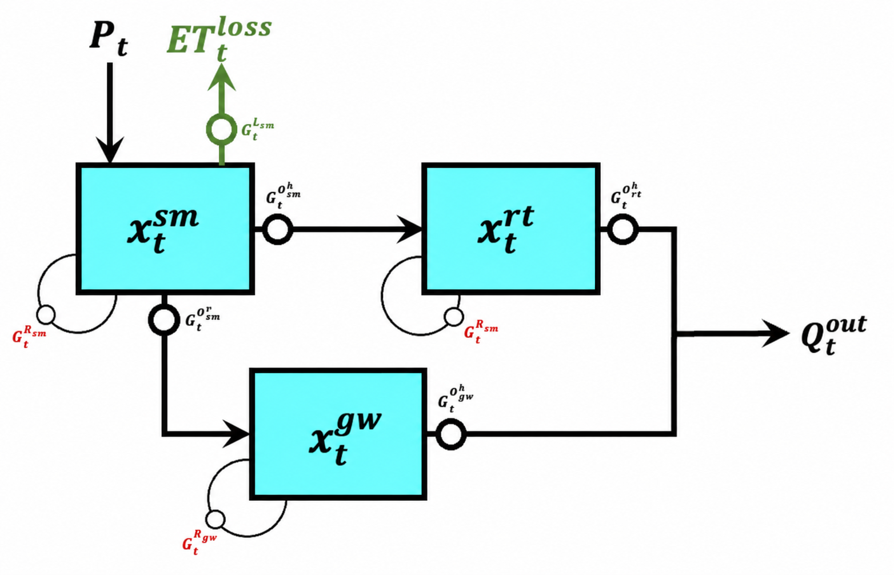
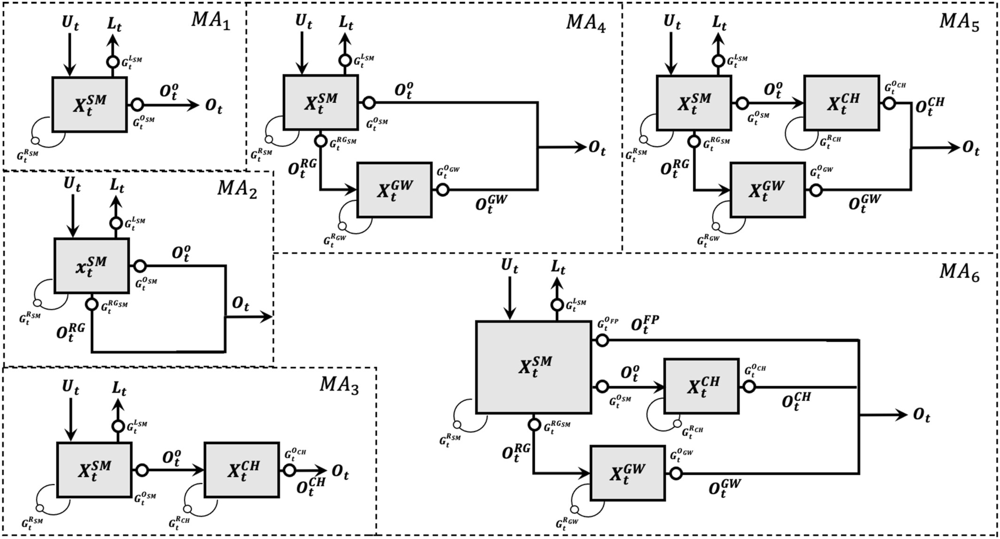
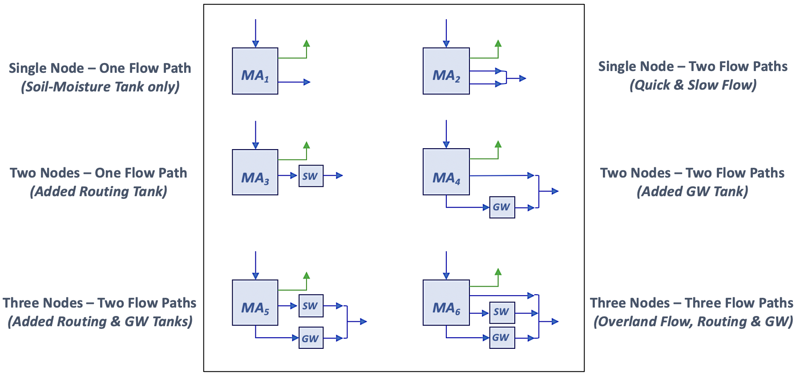

# Mass-Conserving Perceptron (MCP) HyMod Architecture Model Zoo

This repository organizes the research code accompanying Wang & Gupta (2024) into a documented collection of mass-conserving-perceptron (MCP) models. The implementations were originally released on [Zenodo](https://zenodo.org/records/13840681) and have since been cleaned, refactored, and reorganized with assistance from OpenAI's ChatGPT (GPT-6.1 Sol, Max intelligence mode).

## Quick Start

### Requirements

Use Python 3.10 and install the dependencies listed in `requirements.txt`, including NumPy, pandas, PyTorch, and scikit-learn. Run the following command from the repository root:

```bash
python -m pip install -r requirements.txt
```

### Leaf River Data

The example data are provided in `20220527-MDUPLEX-LeafRiver/`, the default data directory used by the training and evaluation scripts.

- `LeafRiverDaily_43YR.txt`: daily precipitation (`P`), potential evapotranspiration (`PET`), and streamflow (`Q`), in that column order and all in mm/day.
- `LeafRiverDaily_43YR_Flag.txt`: flags identifying the data subsets used for model spin-up, training, selection, and testing.

| Flag | Data subset |
| ---: | :--- |
| `-99999` | Spin-up |
| `-1` | Training |
| `0` | Selection |
| `1` | Testing |

The data sequence includes three repetitions of water year 1949 for spin-up, followed by the 40-year simulation period covering water years 1949–1988.

### Pretrained Checkpoints

Pretrained Leaf River checkpoints are included in the model folders. They can be used for direct evaluation or as starting points for continued training and fine-tuning.

For example, evaluate the supplied MA₁ checkpoint from the repository root:

```bash
python MA1/evaluate_Main_MA1_clean.py
```

Additional examples are provided in [Running the Models](#running-the-models).

## HyMod-Like Conceptual Reference

The conceptual reference is the three-tank, two-flow-path HyMod-like structure inspired by Boyle (2000), illustrated in Figure 1. Its three tanks represent soil-moisture storage, surface-routing storage, and groundwater storage. The two flow pathways represent surface and subsurface flow.



*Figure 1. MCP representation of the three-tank, two-flow-path HyMod-like conceptual structure adopted in this study.*

**Note:** HyMod has several versions with different storage and routing configurations. The structure shown in Figure 1 is the conceptual version adopted in this study, with MCP gating functions describing the storage and flow processes.

## MCP-Based Model Architectures

Figure 2 presents the six main MCP-based model architectures, MA₁–MA₆. Each node represents a physically interpretable conceptual storage state, while the links represent water transfers and flow pathways.

Compared with conventional conceptual models, these architectures replace time-constant coefficients for flow partitioning and storage release with time-variable gating functions that respond to the evolving states and relevant inputs. The parameters defining these functions remain fixed during evaluation, while the gate values vary over time.



*Figure 2. Detailed structures of the six main MCP-based model architectures, MA₁–MA₆.*

Figure 3 provides a complementary conceptual overview of the storage states and streamflow pathways represented by each architecture.



*Figure 3. Simplified conceptual representations of MA₁–MA₆, showing their storage elements and streamflow pathways.*

| Model | Storage states | Streamflow pathways | Conceptual representation |
| :--- | :---: | :---: | :--- |
| MA₁ | 1 | 1 | Soil-moisture storage only |
| MA₂ | 1 | 2 | Soil-moisture storage with two outlet flow pathways |
| MA₃ | 2 | 1 | Soil-moisture storage followed by surface routing |
| MA₄ | 2 | 2 | Soil-moisture and groundwater storage |
| MA₅ | 3 | 2 | Soil-moisture, surface-routing, and groundwater storage |
| MA₆ | 3 | 3 | MA₅ with an additional direct overland-flow pathway |

Additional variants incorporate input bypass and groundwater mass relaxation.

### Progressive Model Development

The models were developed and trained progressively. Parameters for components retained from earlier architectures were initialized with their previously trained values. Newly introduced components received new parameter initializations, and both inherited and new parameters were adjusted during training.

For example, MA₅ inherited initial parameter values for its soil-moisture, surface-routing, and groundwater components from MA₂, MA₃, and MA₄, respectively.

### Input-Bypass Variants

The paper examines two input-bypass formulations. **BP₁** represents saturation-excess runoff using a learned soil-moisture storage capacity, with excess precipitation bypassing the storage. **BP₂** uses a gating function that depends on both soil-moisture storage and precipitation intensity, allowing it to represent a combination of saturation-excess and infiltration-excess processes. These variants are provided for all six architectures in the `MA1-BP1`–`MA6-BP1` and `MA1-BP2`–`MA6-BP2` folders.

### Groundwater Mass Relaxation

For MA₄, MA₅, and MA₆, which include an explicit groundwater tank, we also tested a mass-relaxation gate that allows state-dependent, bidirectional water exchanges with the surrounding environment. These cases are provided in the `MA4-GWMR`, `MA5-GWMR`, and `MA6-GWMR` folders. Our earlier single-node MCP study introduced several mass-relaxation formulations; the groundwater variants included here use only the **Regular-Relaxed** formulation. For the other formulations and their implementations, see the [MCP Single-Node Model Zoo](https://github.com/YuanHWang/MCP-SingleNode-ModelZoo).

## Running the Models

The scripts for MA₁–MA₆ are organized in the corresponding `MA1`–`MA6` folders. Run the following example commands from the repository root to work with MA₁.

### Continue Training or Fine-Tune MA₁

```bash
python MA1/mcpbrnn_Main_MA1_clean.py --epoch_no 100 --case_no 1 --checkpoint model_epoch27.pt
```

This command loads the supplied MA₁ checkpoint and runs 100 additional training epochs. The case identifier `1` is used to name the output folder and files. The script saves the checkpoint with the highest selection-set KGE obtained during the current run.

### Evaluate a Pretrained MA₁ Checkpoint

```bash
python MA1/evaluate_Main_MA1_clean.py --checkpoint model_epoch27.pt
```

This command evaluates the checkpoint without updating its parameters and exports simulated discharge, diagnostic time series, and performance metrics.

### Command-Line Arguments

| Argument | Purpose |
| :--- | :--- |
| `--epoch_no` | Number of training epochs to run; training only |
| `--case_no` | Case identifier used to name training outputs; training only |
| `--checkpoint` | Compatible model checkpoint to load for training or evaluation |

For MA₁, both scripts default to `model_epoch27.pt` if `--checkpoint` is omitted. Relative checkpoint paths are resolved from the script's folder. For other architectures, use the corresponding scripts and compatible checkpoints in their model folders.

## References

Readers should consult the original paper for the formal model names, notation, and mathematical definitions associated with each MCP variant.

- Full article: [Wang & Gupta (2024)](https://agupubs.onlinelibrary.wiley.com/doi/full/10.1029/2024WR037224)
- DOI: [10.1029/2024WR037224](https://doi.org/10.1029/2024WR037224)

> Wang, Y.-H., & Gupta, H. V. (2024). Towards interpretable physical-conceptual catchment-scale hydrological modeling using the mass-conserving-perceptron. *Water Resources Research, 60*(10), e2024WR037224. https://doi.org/10.1029/2024WR037224

> Boyle, D. P. (2000). *Multicriteria Calibration of Hydrologic Models*. University of Arizona, Department of Hydrology and Water Resources, Tucson.

